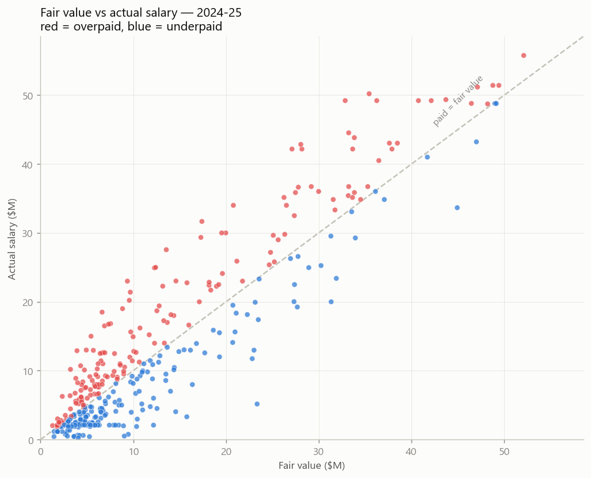
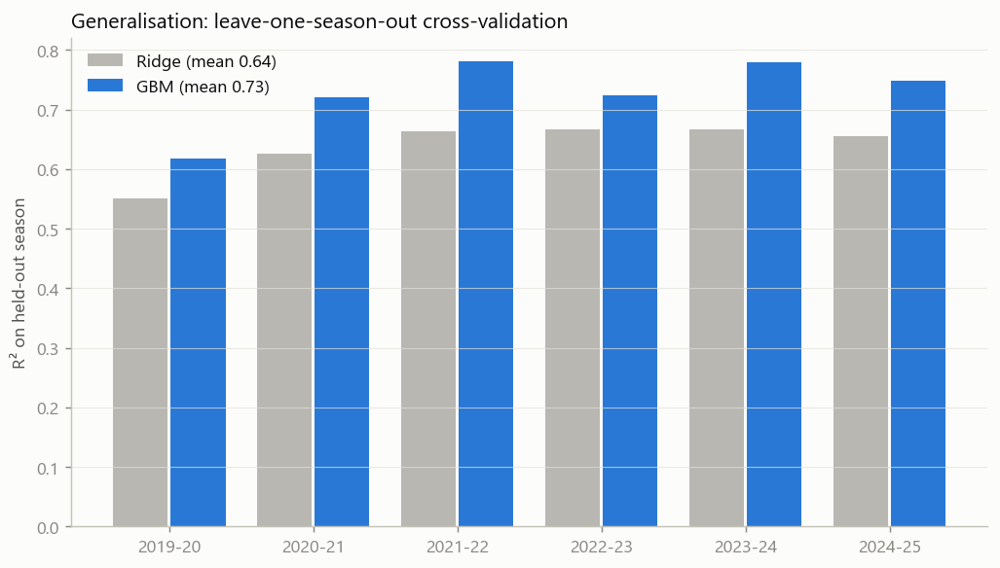

# 🏀 NBA Fair-Value Model

**Which NBA players are overpaid or underpaid — and by how many dollars?**

<p align="center">
  <a href="https://nba-fair-value.streamlit.app/">
    
  </a>
  &nbsp;
  
  &nbsp;
  
</p>

A machine-learning model learns each player's *fair* salary from on-court
performance alone, then flags the gap between what they're actually paid and
what they're worth. Trained on **six seasons (2019-20 → 2024-25, ~2,100
player-seasons)** scraped fresh from Basketball-Reference and ESPN.

> 📊 [How it works](#how-it-works) · 🧪 [Reproduce it](#reproduce-it) · ▶️ [Live demo](https://nba-fair-value.streamlit.app/)



*Every dot is a player-season. Points above the dashed line are paid more than
the model's fair value (**red = overpaid**); below it, less (**blue =
underpaid**).*

---

## Headline results

| | |
|---|---|
| **Model** | Gradient-boosted trees predicting salary as a % of the season cap |
| **Validation** | Leave-one-**season**-out CV — train on five seasons, test on a held-out one |
| **Skill** | **R² ≈ 0.73**, stable across every held-out season (0.62–0.78) |
| **Output** | A fair-value dollar figure and over/underpaid residual for every player |



**Face validity** — the model recovers cases any fan would recognise, without
ever being told who they are:

| Most overpaid (paid ≫ fair) | Most underpaid (paid ≪ fair) |
|---|---|
| Gordon Hayward, Klay Thompson (decline) | Desmond Bane, Trey Murphy III (rookie deals) |
| Otto Porter Jr., Paul Millsap (aging vets) | Pascal Siakam '19-20, Donovan Mitchell (pre-extension) |

---

## How it works

**The problem with the naïve approach.** The original version of this project
(a university assignment, see [`docs/assignment-origin`](docs/assignment-origin))
fed *salary itself* and salary-derived ratios into an anomaly detector — so it
was partly detecting salary from salary. It also had no way to say whether its
flags were *right*.

**The fix — a fair-value model.**

1. **Performance-only features.** The model sees scoring, rebounding, playmaking,
   efficiency (PER, TS%, USG%, BPM, VORP, Win Shares), age, and availability —
   **never salary**. A [unit test](tests/test_features.py) fails the build if any
   salary-derived column leaks into the feature matrix.
2. **Predict fair value.** A gradient-boosted regressor predicts salary as a
   fraction of that season's cap (so 2019 and 2024 contracts are comparable). A
   Ridge baseline is kept for interpretability.
3. **Residual = over/underpaid.** `actual − predicted`, converted to dollars.
   Now every flag comes with a magnitude: *"~$18M above fair value"*, not just
   an unlabeled anomaly.
4. **Honest validation.** Leave-one-season-out CV measures whether the model
   generalises to a season it never saw — the rigor the original lacked.
5. **Explainability.** Per-player contribution bars (standardized linear
   coefficients) show *why* a player's fair value is high or low.
6. **Second lens.** Isolation Forest + LOF still run — now on the clean,
   performance-only space — as a complementary "statistically unusual player"
   view.

**What the model learned:** *age* and *scoring* dominate fair value — a candid
reminder that NBA pay tracks tenure and contract mechanics (rookie scale,
veteran max) as much as raw production.

---

## Reproduce it

```bash
pip install -r requirements.txt

# 1. (optional) re-scrape the raw data from Basketball-Reference + ESPN
python -m nba_fair_value.scrape          # writes data/raw/nba_<season>.csv

# 2. build the processed dataset (salary normalised to % of cap)
python -m nba_fair_value.data            # writes data/processed/players.parquet

# 3. train, cross-validate, and rank over/underpaid players
python -m nba_fair_value.pipeline        # writes outputs/fair_value_results.csv

# 4. regenerate the figures / run the app / run the tests
python scripts/make_figures.py
streamlit run app/streamlit_app.py
pytest -q
```
_Set `PYTHONPATH=src` (or `pip install -e .`) so the package is importable._

### Deploy the demo (free)
Push this repo to GitHub → [share.streamlit.io](https://share.streamlit.io) →
"New app" → point it at `app/streamlit_app.py`. Paste the resulting URL into the
**Live demo** link above and embed it in your site with an `<iframe>`.

---

## Repository layout

```
src/nba_fair_value/   data · features · models · evaluate · explain · glossary · viz · scrape
app/streamlit_app.py  interactive explorer (player lookup, leaderboards, charts)
scripts/make_figures.py  regenerate README figures
tests/                leakage + feature-engineering unit tests
data/raw · processed  per-season CSVs → merged parquet
docs/assignment-origin  the original single-season assignment (provenance)
```

---

## Data & honest limitations

- **Sources:** stats from [Basketball-Reference](https://www.basketball-reference.com),
  salaries from [ESPN](https://www.espn.com/nba/salaries), joined on normalised
  player names per season. Spot-checked against the record (e.g. Stephen Curry
  2022-23 = $48,070,014, matches to the dollar).
- **Salary = ESPN season cap hit.** For waived / bought-out players this can be
  far below the nominal contract (e.g. Russell Westbrook 2022-23 shows ~$0.5M
  after his buyout), which can misleadingly read as "underpaid." Treated as a
  documented artifact, not corrected.
- **Descriptive, not prescriptive.** The model reflects how the market *has*
  paid for production; it is not a contract recommendation engine.
- **Age effect** partly encodes contract rules (rookie scale, max tiers), not
  pure talent.

---

## Origin

Started as a 30%-weighted Data & Web Mining university assignment (Isolation
Forest on a single 2022-23 season). Rebuilt into this multi-season, validated,
deployed project — the original materials are preserved in
[`docs/assignment-origin`](docs/assignment-origin).

📄 MIT licensed.
